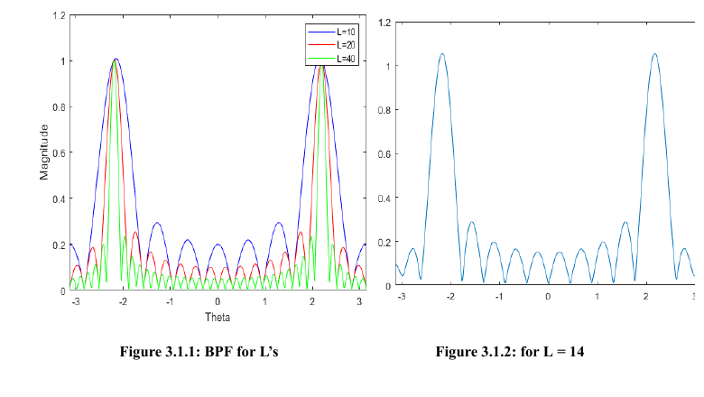

# Signals (5ESE0), TU/e

MATLAB exercises for the introductory Signals course (5ESE0) at Eindhoven University of Technology. The labs build up from MATLAB basics and complex-number arithmetic to Fourier series, sampling and aliasing, discrete-time systems and convolution, FIR frequency response, and finally a full continuous-to-digital-to-continuous filtering chain written up as a lab report.

## Labs

**Lab 0, MATLAB basics.** A first function definition and a loop, used to get familiar with the environment.

**Lab 1, MATLAB fundamentals.** Operator precedence and expression evaluation, vector and matrix operations (inner products, outer products, element-wise products), a triangle-area function using Heron's formula with a validity check on the side lengths, and plotting several functions across a shared domain with subplots.

**Lab 2, complex numbers and phasors.** Complex arithmetic, magnitude and phase, and plotting complex numbers as vectors on the complex plane. Generation of cosine signals and complex exponentials, and adding a reference signal to reflected copies at phase offsets of 0, pi/2, pi, and 3pi/2 to show constructive and destructive interference.

**Lab 3, Fourier series and modulation.** Synthesizing periodic signals from their Fourier coefficients and watching the reconstruction improve as more harmonics are added, building a signal from a given frequency spectrum, and an amplitude-modulation example with a 500 Hz carrier and a slow message signal.

**Lab 4, sampling and aliasing.** Sampling continuous cosines and comparing the samples against the underlying waveform with `stem`, folding an analog frequency into its principal normalized frequency theta in the range (-pi, pi], and reconstructing the aliased signal for a different sampling rate.

**Lab 5, discrete-time systems and convolution.** Building impulse responses (a decaying exponential), applying moving-average filters by convolution, and cascading a filter with an approximate inverse to recover the input, reporting the maximum reconstruction error.

**Lab 6, FIR frequency response.** Computing the frequency response of a 4-point moving average with `freqz`, locating the nulls of the response, and using a second-order FIR notch filter to remove a specific cosine component from a mixed signal.

**Lab 7, digital filtering of a continuous-time signal.** The final assignment, written up in `lab7-1819283.pdf`. A three-tone signal is sampled by a C/D converter, one tone is knocked out by a nulling FIR filter (theta_null = 0.4pi), a bandpass FIR filter partially suppresses another tone, and a D/C converter returns the result to continuous time. The report determines which tone aliases at the chosen sampling rate, derives the nulling filter's magnitude and phase response by hand, and studies how the bandpass filter length L trades off against passband width.



Magnitude response of the bandpass FIR filter for lengths L = 10, 20, 40 (left) and L = 14 (right), from the lab 7 report. Doubling the filter length halves the passband width.

## Repository layout

```
lab0/  MATLAB basics: functions and loops
lab1/  expression evaluation, vectors and matrices, plotting
lab2/  complex numbers, phasors, cosine and complex-exponential signals
lab3/  Fourier series synthesis, spectra, amplitude modulation
lab4/  sampling, aliasing, principal-alias frequency mapping
lab5/  impulse responses, convolution, filter inversion
lab6/  FIR frequency response, nulls, notch filtering
lab7/  full C/D, FIR, bandpass, D/C chain (see lab7-1819283.pdf)
```

## Running

The scripts run in MATLAB. Open a lab folder and run a script; several exercises are functions that take input arguments (example calls are left in comments, for instance `ex1(2, 0.9, 10, 3)` in `lab5/ex1.m`). Lab 5 loads `lab5data.mat`, and the lab 7 scripts play the signals through the speakers with `sound` / `soundsc`.

## Technologies

- MATLAB
- Signal Processing Toolbox (`freqz`, `conv`)
